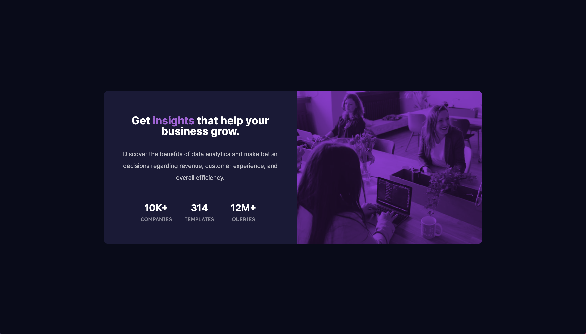

# Frontend Mentor - Stats preview card component solution

This is a solution to the [Stats preview card component challenge on Frontend Mentor](https://www.frontendmentor.io/challenges/stats-preview-card-component-8JqbgoU62). Frontend Mentor challenges help you improve your coding skills by building realistic projects. 

Preview:
## Table of contents

- [Overview](#overview)
  - [The challenge](#the-challenge)
  - [Screenshot](#screenshot)
  - [Links](#links)
  - [Built with](#built-with)
  - [What I learned](#what-i-learned)
  - [Continued development](#continued-development)
  - [Useful resources](#useful-resources)
 - [Author](#author)


**Note: Delete this note and update the table of contents based on what sections you keep.**

## Overview

### The challenge

Users should be able to:

- View the optimal layout depending on their device's screen size

### Screenshot

Screenshot: 

### Links
- Live Site URL: [anoushkagupta876.github.io/statistics-preview/](https://anoushkagupta876.github.io/statistics-preview/)

### Built with

- Semantic HTML5 markup
- Reset CSS
- CSS custom properties
- Flexbox
- Media Queries
- Mobile-first workflow

### What I learned

I explored the mix-blend-mode for an image in CSS and how surprisinlgy how versatile and creative one can be with it.

```css
.image{
background-color: hsl(277, 64%, 30%);
border-radius: 10px 10px 0 0;
}

.image img{
  padding: 0;
  margin: 0;
  display: block;
  border-radius: 10px 10px 0 0;
  width: 100%;
  opacity: 0.7;
  mix-blend-mode: overlay;
}
```

### Continued development

I would definitely like to explore mix-blend-mode further. Though I made this responsive without Bootstrap and was pretty quick, but I would definitely like to try a Bootstrap version. 

### Useful resources
- [MDN](https://developer.mozilla.org/en-US/) - This is an website  which I refer back and forth for syntax and properties. I'd recommend it to everyone - beginners and professionals.

## Author

- Website - [Anoushka Gupta](https://anoushkagupta876.github.io/Anoushka/)
- Frontend Mentor - [@anoushkagupta876](https://www.frontendmentor.io/profile/anoushkagupta876)


